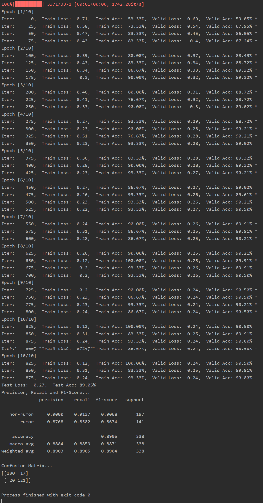
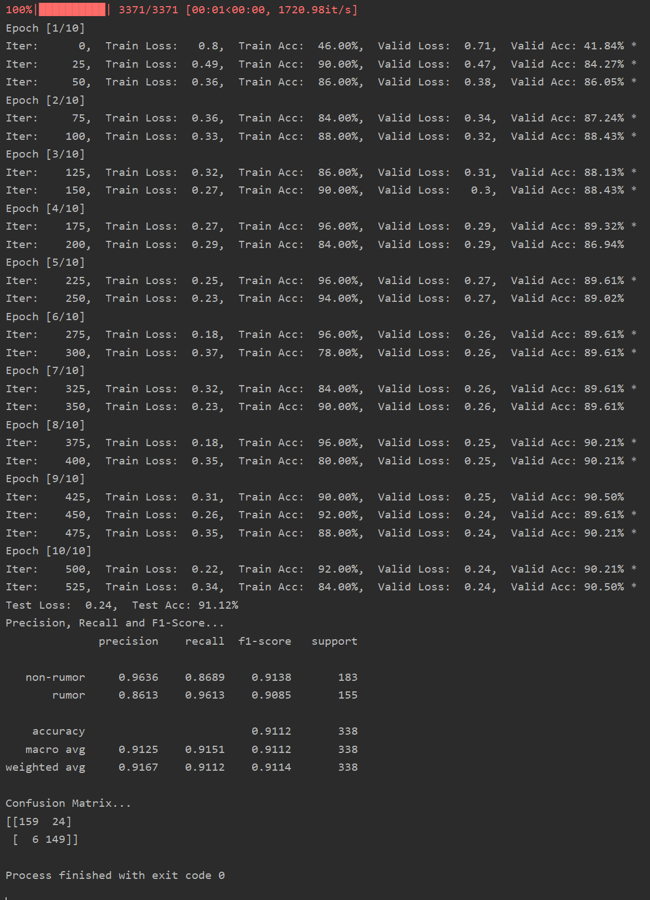

## 使用微博谣言数据集的深度学习项目🧀

#### 注：是否使用K折交叉验证在run.py中可选
对于模型的选择在run.py中只需更改这三处即可&#x1F352;

###**一、使用5折交叉验证的结果如下** 

#### 1. LSTM的结果:

#### 2. 双向LSTM(Bidirectional LSTM)

#### 3. SVM的结果(直接运行SVM_classify.py即可):

#### 4. TextCNN的结果:

###**二、使用bert模型的结果**
#### 5.使用bert对post做词嵌入提取特征，然后使用一层全连接网络做二分类的结果：

#### 6.使用bert对post[sep]review 做词嵌入提取特征，然后使用一层全连接网络做二分类的结果：

#### Hyperparameter tuning
pad_size的值设置成数据集中所有post按递增排序，90%位置的长度

